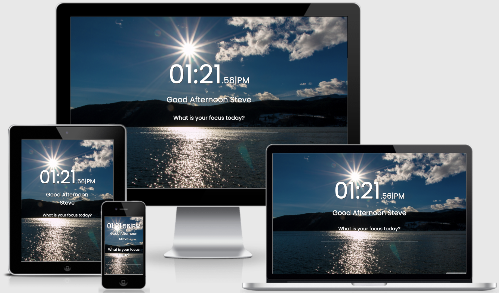
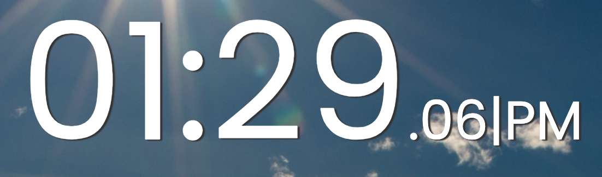
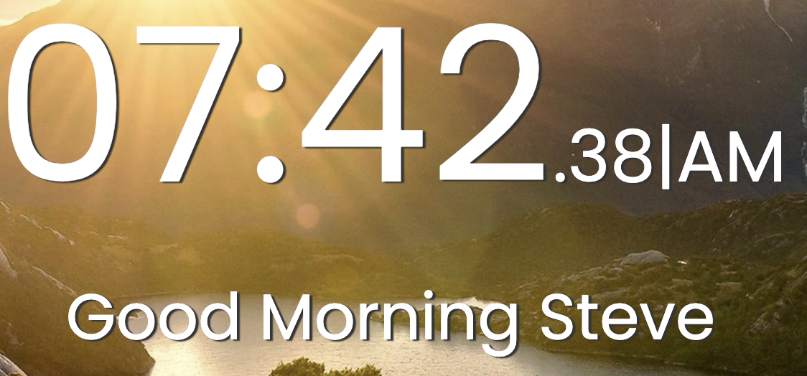
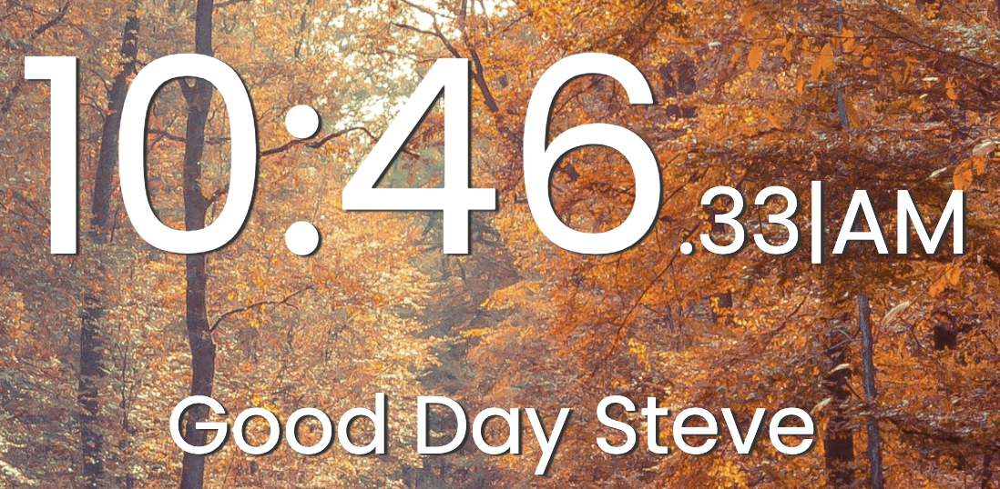
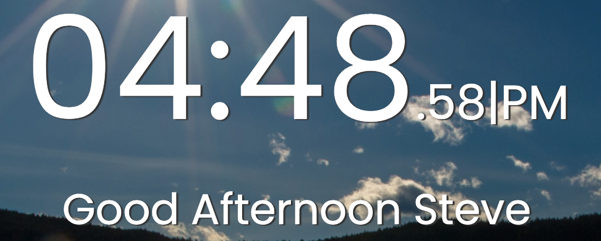
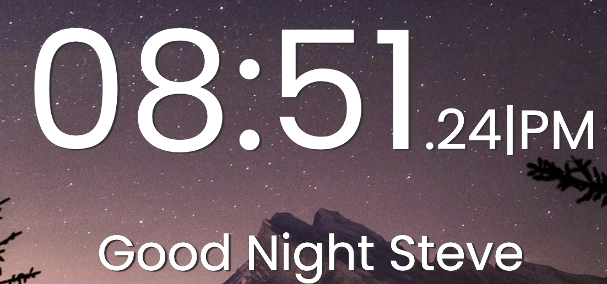
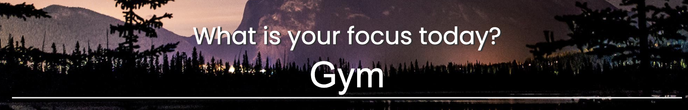
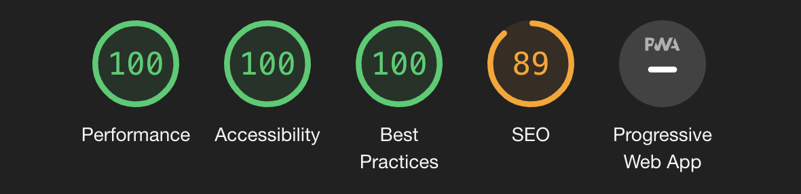

# Live Digital Mood Clock
This responsive app is designed for people to have a live clock running on their screens with their
goal for the day as a reminder. 

## Features:
This app was designed, with simplistic and responsive features which helps benefit the user by being a daily reminder of the time and their goals. 
It includes a live clock, a task input, and beautiful landscape backgrounds to make the user's screen pop.

## Existing Features:

#### Interchangable Backgrounds:
 - Beautiful landscape portrait backgrounds that change based on the local's time of the day.
 
     - If the hour is less than 8 AM, then the backgroud automatically switches to a morning type background.
     

     - If the hour is less than 11 AM, then the background automatically switches to a day type background.
     

     - If the hour is less than 8 PM, then the background automatically switches to an afternoon type background.
     

     - If the hour is more than 8 PM, then the background automatically switches to a night type background.
     

#### Live Clock:
- Live Clock that presents the time(hours, minutes & seconds) of day based on local host, with an AM/PM session.

#### Good Morning, Good Day, Good Afternoon, Good Evening:
- Good Morning text
  - If the hour is less than 8 AM, then a 'Good Morning' text shows up.
  

- Good Day text
  - If the hour is less than 11 AM, then a 'Good Day' text shows up.
  

- Good Afternoon text
  - If the hour is less than 8 PM, then a 'Good Afternoon' text shows up.
  

- Good Night text
  - If the hour is more than 8 PM, then a 'Good Night' text shows up.
  

#### Daily Task Reminder
- 'What is your focus today?' text.
  - Includes input field where the user put their today's task in and have it as a reminder on the screen.
  
Once the input is given, the task will stay on the screen underneath 'Today': 

## Features left to implement
   - User 24h format instead of 12.
   - Add more inputs for daily tasks
   - Add a deadline feature.
   - Design and style the live clock feature.
   - Add feature where user can choose from various backgrounds and set them manually.

## Testings

  All app's features and interactivity function as intended, various testings were conducted.
   

 
## Validator Testing
- HTML
   - No errors returned when passing through the official [W3C Validator](https://validator.w3.org/nu/?doc=https%3A%2F%2Fcode-institute-org.github.io%2Flove-running-2.0%2Findex.html)

- CSS
  - No errors were found when passing through the official [(Jigsaw) Validator](https://jigsaw.w3.org/css-validator/validator?uri=https%3A%2F%2Fvalidator.w3.org%2Fnu%2F%3Fdoc%3Dhttps%253A%252F%252Fcode-institute-org.github.io%252Flove-running-2.0%252Findex.html&profile=css3svg&usermedium=all&warning=1&vextwarning=&lang=en#css)

- JS
  - No errors were found when passing through [JSHint](https://jshint.com/)

## Unfixed Bugs
None found.

## Deployment
- The site was deployed to GitHub pages.

Live link: https://stevealsamarae.github.io/JS-MSP2/

Github link: https://github.com/SteveAlsamarae/JS-MSP2

## Credits
* Credits Code Institude, tasks taught me a lot on how to put together. Help from mentor, and the slack community.

* Credits Udemy for also offering me a course that I have undertaken.

* Credits W3schools.

The concept of this app is not original.

### Media
  - All images used were taken from
    - https://wallpapercave.com/
    - https://jooinn.com/
    - https://wallpaperaccess.com/
    
